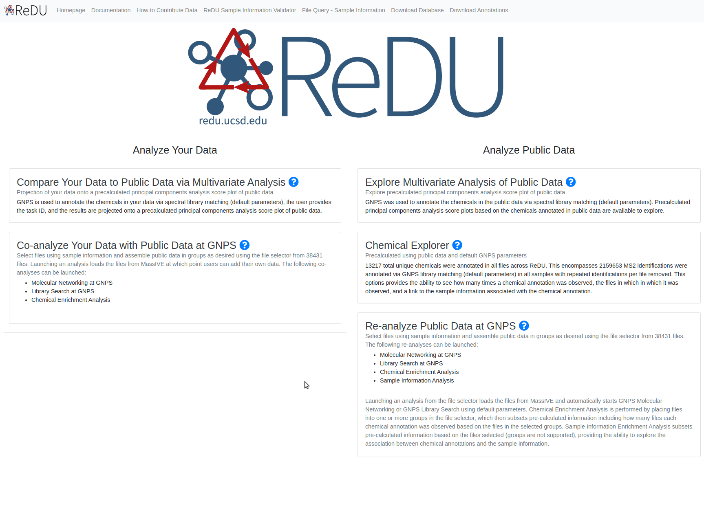

# Analyze Public Data: Re-analyze Your Data with Public Data at GNPS

## Chemical Explorer (on a subset of public data)

---

### Example Use Cases
* **Explore which chemicals have been detected in *a subset of* the public data** in order to test or develop hypotheses, and determine the specific files in the public data that are relevant for follow up analysis. *viz.* I'm interested in the chemical differences between human urine and human blood - what are they?

---

### Summary
**All chemical annotations that originate from the selected public data are tabulated by group (G1-G6).** Chemical annotation is performed in [GNPS](https://gnps.ucsd.edu/ProteoSAFe/static/gnps-splash2.jsp) by comparing MS2 spectra, specifically product ion spectra, with reference MS2 fragmentation patterns (GNPS integrates of the majority of public reference MS2 spectra library). Default library search parameters are used.

---

### Instructions
1. Navigate to the [ReDU](https://redu.ucsd.edu/) homepage.
2. Click on the **"Re-analyze Public Data at GNPS"** text.
3. Select the files you wish to include in the re-analysis by clicking the G1 button.
  - The orange buttons in the center of the screen correspond to Sample Information categories.
  - If filter/s are used, they will appear as red box/boxes in the Attribute Filters Panel (upper-right corner) of the page. To remove already selected filters click on the red boxed filter you wish to remove and the item should disappear from Attribute Filters Panel.
  - When files are selected into a group the corresponding button becomes red and the number of files is updated in the Selection Summary Panel (upper-left corner).
4. Click on the **Launch Chemical Explorer** button (blue) at the bottom of the page.
5. The resulting table displays the chemicals annotated.
  - Download buttons are in the upper-left corner
  - Search box in the upper-right corner
  - The files in which the annotations were found can be found by clicking the "View Files" button.
6. Sample Information Associations can be determined by clicking on the "View Associations" button.
  - Download buttons are in the upper-left corner
  - Bar plot is displayed

 
