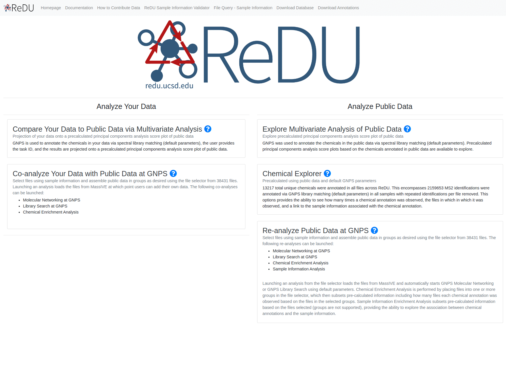

#Analyze Your Data: Re-analyze Your Data with Public Data at GNPS

##Multivariate Analysis of Selected Files

___

###Summary
The **Launch PCA of Selected Files** function allows the user to perform mulivariate analysis on a subset of files. First, the user selects samples based on sampel information category (*i.e.* MassSpectrometer) through the file filtration interface. A single button click on "Launch PCA of Selected Files" loads all the files and calcualte the principal coordinate analysis values per sample, which then displays via a 3D Emperor visualization.

___

### Tutorial
1. Navigate to the [ReDU](https://redu.ucsd.edu/) homepage.
2. Click on [Re-analyze Public Data at GNPS](https://redu.ucsd.edu/metadataselection) or [Co-analyze Your Data with Public Data at GNPS](https://redu.ucsd.edu/metadataselection).
3. Select the files you wish to include in the analysis by clicking the desired group button (*i.e.* G1-G6).
  * The orange buttons in the center of the screen correspond to Sample Information categories.
  * If filter/s are used, they will appear as red box/boxes in the Attribute Filters Panel (upper-right corner) of the page. To remove already selected filters click on the red boxed filter you wish to remove and the item should disappear from Attribute Filters Panel.
  * When files are selected into a group the corresponding button becomes red and the number of files is updated in the Selection Summary Panel (upper-left corner).
4. Click on the **Launch PCA of Selected Files** button (blue) at the bottom of the page.

__

###Notes:
  * The addtion of files to groups (G1-G6) will not affect the analysis in any way, and will not be included in the visualization.
