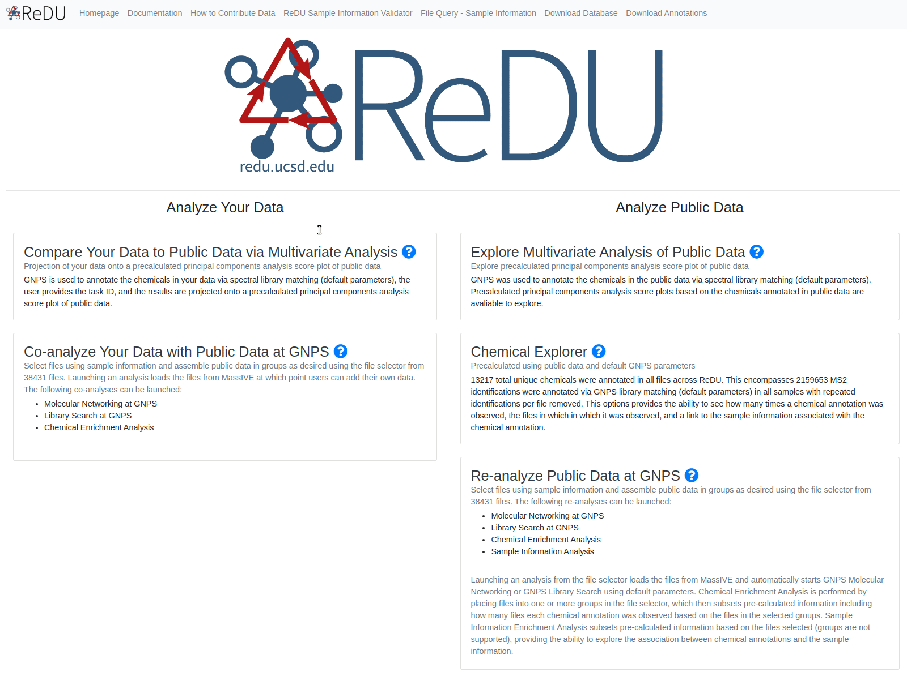

# How to Contribute to ReDU

---

## Required Items and Summary of Steps

!!! info "Required Items of Summary of Steps"
	1. **Mass spectrometry data (MS/MS data)**
		- Data converted to open-format (.mzXML or .mzML)
		- Data uploaded to MassIVE [link here](https://massive.ucsd.edu/ProteoSAFe/static/massive.jsp) as a public dataset
	2. **ReDU-compliant sample information**
		- Manual completion of the **ReDU sample information template** ([link here](https://docs.google.com/spreadsheets/d/1v71bnUd8fiXX51zuZIUAvYETWmpwFQj-M3mu4CNsHBU/edit?usp=sharing))
		- Validation of the ReDU sample information template using the drag-and-drop validator [link here](https://redu.ucsd.edu/ReDUValidator)
		- Upload ReDU-compliant sample information (after validation) to the corresponding MassIVE accession

---

## Detailed Step-by-step Instructions

### 1. **Mass spectrometry data (MS/MS data)**

#### 1.1 Convert mass spectrometry data to open-source file formats
- Convert data

??? info "links to info on data conversion"
    - Instructions on file conversion software - [link here](https://github.com/CCMS-UCSD/GNPSDocumentation/blob/master/docs/fileconversion.md)
    - Information on accepted open-source files formats - [link here](https://github.com/CCMS-UCSD/GNPSDocumentation/blob/master/docs/isgnpsright.md)

#### 1.2 Upload mass spectrometry data to GNPS/MassIVE and create a MassIVE ID
- Launch the "Submit your data" workflow to submit your data to MassIVE - [link here](https://massive.ucsd.edu/ProteoSAFe/static/massive.jsp?redirect=auth)) - to create a MassIVE ID. **The title must beginning with "GNPS"**
- You will receive an email when the workflow has completed.
- After complete, make the MassIVE ID public by clicking the **"make public"** button.
- Please click the **"convert spectra"** button to expedite inclusion in ReDU.

!!! note
	A free GNPS/MassIVE account is required. Please sign-up at the MassIVE homepage - [link here](https://massive.ucsd.edu/ProteoSAFe/static/massive.jsp) 

??? info "links to info on uploading data and making datasets in MassIVE"
    - Information on making datasets in MassIVE - [link here](https://ccms-ucsd.github.io/GNPSDocumentation/datasets/)
	- Suggested FTP clients - [link here](https://ccms-ucsd.github.io/GNPSDocumentation/fileupload/)
	- We encourage the upload of vendor-specific raw data, *e.g.* .raw (Thermo) and .d (Bruker and Agilent), in addition to open-source file formats (.mzXML, .mzML, or .mgf).  

### 2. **ReDU-compliant sample information**

#### 2.1 Manual completion of the ReDU sample information template
- Navigate to the ReDU Sample Information Template - [link here](https://docs.google.com/spreadsheets/d/1v71bnUd8fiXX51zuZIUAvYETWmpwFQj-M3mu4CNsHBU/edit?usp=sharing)
- Save a copy of the sample information template by going to **"File - Make a copy"** into a personal google drive

- Fill in sample information using drop-downs when applicable (grey columns at the end of the template are automatically entered using formulae).

!!! notes "notes on using the sample information template"
	- Columns and values are defined on the readme tab in the template.
	- The filename in the sample information file must match the data uploaded to MassIVE (.mzML or .mzXML).
	- When copying and pasting from another spreadsheet, please **copy + special paste** so as to not chance the cell formulae or formatting.

- ReDU uses a controlled vocublary - the accepted terms are listed in the "ReDUMS2_controlled_vocabulary" tab per column. **If you require terms that are not avaliable, please raise an issue on GitHub - [link here](https://github.com/mwang87/ReDU-MS2-GNPS).**

     > Notes:  
      - One template is required per MassIVE ID.  
      - It is highly recommended to fill the template in Google Sheets.  
      - Any conflict between identically named files will result in their exclusion.  
  
#### 2.2 Validation of the ReDU sample information template using the drag-and-drop validator
- When complete, **delete all extra rows** of the template
- Download from Google Sheets as a tab separated text file using **"File-Download as" and selecting "Tab-seperated values..."**

- Navigate to the ReDU Sample Information Validator - [link here](https://redu.ucsd.edu/ReDUValidator)
- Drag-and-drop or select your sample information file into the validator.
    - A message will indicate if the files passes or not.
    - Non-adherant information is displayed in the "Sample Information Validation Errors" panel - the row, column, and the accepted terms are listed.
    - If errors occur, then please correct the non-adherant information in the template and repeat from 2C

- Upon passing the validator, **rename the file** to be exactly **"gnps_metadata.tsv"**
    - The filename must be **gnps_metadata.tsv** - this step is critical

     > Notes:  
      - If corrections or updates are necessary, please make them accordingly and upload the new validated sample information file named **"gnps_metadata.tsv"**. ReDU will automatically import the most recent version of the "gnps_metadata.tsv" file (files cannot be deleted by users from MassIVE).  
      - It is suggested to make a seperate directory on your computer to store each MassIVE IDs sample information template.  

#### 2.3 Upload ReDU-compliant sample information (after validation) to the corresponding MassIVE accession
- Navigate to the MassIVE ID created and click on the **"add files"** button.
- Use the Drag-and-Drop upload option to add the validated sample information file named "gnps_metadata.tsv"
- Select the validated sample information file (named exactly **"gnps_metadata.tsv"**) into the **"Supplementary file"** folder
- Submit the update

#### Final Step - Check your data made it into ReDU
- Double check that your data make it into ReDU - [link here](https://redu.ucsd.edu/metadataselection)
- Selecting the "DatasetAccession" button which will load all MassIVE accessions avaliable in ReDU
- Check for your MassIVE accession (*i.e.* MassIVE ID) and confirm the number of files is correct

     > Notes:  
      - GNPS/MassIVE is searched multiple times per day to find new or updated sample information files so it may take some time for your data to appear.  

## Thank you for contributing to ReDU!

## Help and Advice
- General Questions or Advice = GNPS Forum - [link here](https://groups.google.com/forum/#!forum/molecular_networking_bug_reports)  
- New Terms, Corrections, Suggestions = GitHub - [link here](https://github.com/mwang87/ReDU-MS2-GNPS)
