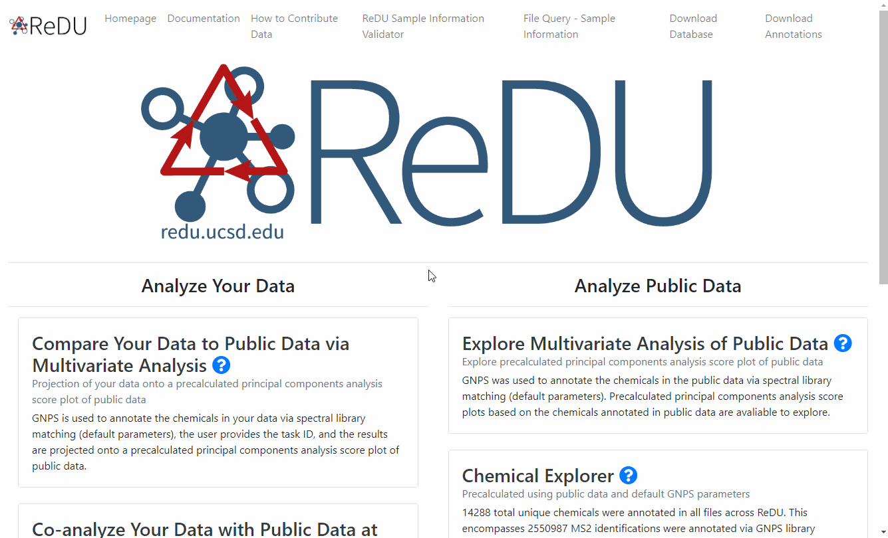

# Chemical Explorer

---

## Chemical Explorer: All Data in ReDU

### Summary
Chemical annotation is performed in [GNPS](https://gnps.ucsd.edu/ProteoSAFe/static/gnps-splash.jsp) by comparing MS2 spectra, specifically product ion spectra, with reference MS2 fragmentation patterns (GNPS integrates the majority of public reference MS2 spectra library). **All chemical annotations that originate from public data are tabulated along with the number of files, a button that then provides the individual file names, and a button that lanches a sample information association.** Further documentation on GNPS is located [here](https://ccms-ucsd.github.io/GNPSDocumentation/).

!!! notes
	- GNPS annotations via spectral reference matching are considered level 2 (putative annotation based on spectral library similarity) or level 3 (putatively characterized compound class based on spectral similarity to known compounds of a chemical class) by the 2007 metabolomics standard initiative [PMID: 24039616](https://www.ncbi.nlm.nih.gov/pmc/articles/PMC3772505/).
	- **The same chemical can have multiple GNPS annotations.** Slight variation in the MS2 spectra (*m/z* or abundance) cause the pattern to match different reference MS2 spectra for the same chemical. Users are highly-encouraged to double check their findings.
	- Query is case-sensitive

!!! info "Example Use Cases"
	- **Explore which chemicals have been detected in the public data** in order to test or develop hypotheses, and determine the specific files in the public data that are relevant for follow up analysis. *viz.* I'm interested in the analysis of piperine (a chemical found in black pepper), but I don't know if I can detect it using mass spectrometry; has this chemical been found in any of the public data?
	- **Launch sample information association** on a specific chemical annotation to test or develop hypotheses, *viz.* I'm interested in the analysis of piperine (a chemical found in black pepper) and it is found in public data, but I don't know what types of samples I should look in; launching sample information association indicates that it is detected in food, human feces, etc.
 
!!! example "Tutorial"
	1. Navigate to the [ReDU](https://redu.ucsd.edu/) homepage.
	2. Click on the **"Chemical Explorer"** under the **Analyze All Public Data** section.
	3. The table will load (this can take a few seconds). You can browse the chemicals either by scrolling down the page or by searching for specific chemicals via Ctrl+F (COMMAND F on MAC OS). **NOTE: The same chemical can have multiple GNPS annotations.**
	4. Users can click on the **View Files** button (orange) on the right side of that page to view the files in which a particular chemical was annotated. **[File Query for Sample Information](https://redu.ucsd.edu/datalookup)** displays all the sample information related to a single file (requires full path).
	5. Users can explore **Sample Information Associations** by clicking the **View Associations** button (orange) on the right side of the page.
		

---

## Chemical Explorer: Subset of Data Selected using the ReDU File Selector

### Summary
**All chemical annotations that originate from the selected public data are tabulated by group (G1-G6).** Chemical annotation is performed in [GNPS](https://gnps.ucsd.edu/ProteoSAFe/static/gnps-splash2.jsp) by comparing MS2 spectra, specifically product ion spectra, with reference MS2 fragmentation patterns (GNPS integrates of the majority of public reference MS2 spectra library). Default library search parameters are used.

!!! notes
	- GNPS annotations via spectral reference matching are considered level 2 (putative annotation based on spectral library similarity) or level 3 (putatively characterized compound class based on spectral similarity to known compounds of a chemical class) by the 2007 metabolomics standard initiative [PMID: 24039616](https://www.ncbi.nlm.nih.gov/pmc/articles/PMC3772505/).
	- **The same chemical can have multiple GNPS annotations.** Slight variation in the MS2 spectra (*m/z* or abundance) cause the pattern to match different reference MS2 spectra for the same chemical. Users are highly-encouraged to double check their findings.
	- Query is case-sensitive

!!! info "Example Use Cases"
	- **Explore which chemicals have been detected in *a subset of* the public data** in order to test or develop hypotheses, and determine the specific files in the public data that are relevant for follow up analysis. *viz.* I'm interested in the chemical differences between human urine and human blood - what are they?

!!! example "Tutorial"
	1. Navigate to the [ReDU](https://redu.ucsd.edu/) homepage.
	2. Click on the **"Re-analyze Public Data at GNPS"** text.
	3. Select the files you wish to include in the re-analysis by clicking the G1 button.
		- The orange buttons in the center of the screen correspond to Sample Information categories.
		- If filter/s are used, they will appear as red box/boxes in the Attribute Filters Panel (upper-right corner) of the page. To remove already selected filters click on the red boxed filter you wish to remove and the item should disappear from Attribute Filters Panel.
		- When files are selected into a group the corresponding button becomes red and the number of files is updated in the Selection Summary Panel (upper-left corner).
	4. Click on the **Launch Chemical Explorer** button (blue) at the bottom of the page.
	5. The resulting table displays the chemicals annotated.
		- Download buttons are in the upper-left corner
		- Search box in the upper-right corner
		- The files in which the annotations were found can be found by clicking the "View Files" button.
6. Sample Information Associations can be determined by clicking on the "View Associations" button.
		- Download buttons are in the upper-left corner
		- Bar plot is displayed
		
