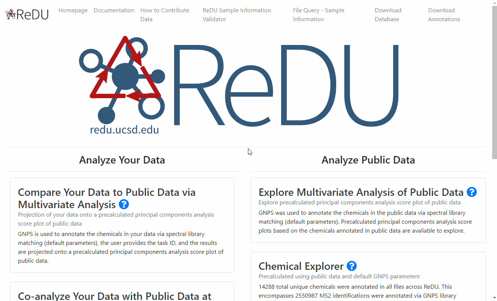

# Repository-scale Molecular Networking

---

## Re-analysis of Public Data via Molecular Networking at GNPS

### Summary
 [Molecular Networking](https://www.nature.com/articles/nbt.3597?WT.ec_id=NBT-201608&spMailingID=52025126&spUserID=ODkwMTM2NjI1NQS2&spJobID=981583612&spReportId=OTgxNTgzNjEyS0) is performed in [GNPS](https://gnps.ucsd.edu/ProteoSAFe/static/gnps-splash.jsp). Users can re-analyze public data by selecting files using the ReDU file selector. The file selector allows one to select (and filter) files based on the sample information provided with every file, and place multiple types of files into one of 6 different groups (*i.e.* G1-G6). A single button click on "Set Up Re-Analysis with GNPS Networking" loads all the files and begins a GNPS molecular job. Further documentation on GNPS molecular networking is located [here](https://ccms-ucsd.github.io/GNPSDocumentation/).
 
!!! notes
	- You must have an account at [GNPS](https://gnps.ucsd.edu/ProteoSAFe/static/gnps-splash.jsp) and be signed in prior to launching a job.
	- The number of groups is currently limited to 6.
	- The suggested limit for molecular networking is a total of **3000 files**.
	
!!! info "Example Use Cases"
	- **Annotate unknown chemicals** Molecular networking links chemicals based on MS/MS spectra similarity. Files across data sets from the same sample type can be selected easily. One can find an annotation of interest and see the chemicals related to it. For example, if one was interested in the metabolism of drug A, and drug A is known to be in blood samples. One could select blood, urine, and fecal samples to see if metabolites of drug A exist in the public data.
 
!!! example "Tutorial"
	1. Log into a [GNPS](https://gnps.ucsd.edu/ProteoSAFe/static/gnps-splash.jsp) account.
	2. Navigate to the [ReDU](https://redu.ucsd.edu/) homepage.
	3. Click on the **"Re-analyze Public Data at GNPS"** text.
	4. Select the files you wish to include in the re-analysis by clicking the desired group button (*i.e.* G1-G6).
		- The orange buttons in the center of the screen correspond to Sample Information categories.
		- If filter/s are used, they will appear as red box/boxes in the Attribute Filters Panel (upper-right corner) of the page. To remove already selected filters click on the red boxed filter you wish to remove and the item should disappear from Attribute Filters Panel.
		- When files are selected into a group the corresponding button becomes red and the number of files is updated in the Selection Summary Panel (upper-left corner).
	5. Click on the **Set Up Re-Analysis with GNPS Molecular Networking** button (blue) at the bottom of the page.
	6. Launch the molecular networking job with default parameters or customize parameters. Further documentation on GNPS molecular networking is located [here](https://ccms-ucsd.github.io/GNPSDocumentation/).
		

---

## Co-analysis of Public Data via Molecular Networking at GNPS

### Summary
[Molecular Networking](https://www.nature.com/articles/nbt.3597?WT.ec_id=NBT-201608&spMailingID=52025126&spUserID=ODkwMTM2NjI1NQS2&spJobID=981583612&spReportId=OTgxNTgzNjEyS0) is performed in [GNPS](https://gnps.ucsd.edu/ProteoSAFe/static/gnps-splash.jsp). Users can re-analyze public data by selecting files using the ReDU file selector. The file selector allows one to select (and filter) files based on the sample information provided with every file, and place multiple types of files into one of 6 different groups (*i.e.* G1-G6). A single button click on "Set Up Re-Analysis with GNPS Networking" loads all the files and begins a GNPS molecular job. Further documentation on GNPS molecular networking is located [here](https://ccms-ucsd.github.io/GNPSDocumentation/).

!!! notes
	- You must have an account at [GNPS](https://gnps.ucsd.edu/ProteoSAFe/static/gnps-splash.jsp) and be signed in prior to launching a job.
	- The number of groups is currently limited to 6.
	- The suggested limit for molecular networking is a total of **3000 files**.
	
!!! info "Example Use Cases"
	- **Annotate unknown chemicals in your samples** Molecular networking links chemicals based on MS/MS spectra similarity. Files across data sets from the same sample type can be selected easily and included with your own data. One can find annotations that enhance the context of your own data by including public data.

!!! example "Tutorial"
	1. Log into a [GNPS](https://gnps.ucsd.edu/ProteoSAFe/static/gnps-splash.jsp) account.
	2. Navigate to the [ReDU](https://redu.ucsd.edu/) homepage.
	3. Click on the **"Re-analyze Public Data at GNPS"** text.
	4. Select the files you wish to include in the re-analysis by clicking the desired group button (*i.e.* G1-G6).
		- The orange buttons in the center of the screen correspond to Sample Information categories.
		- If filter/s are used, they will appear as red box/boxes in the Attribute Filters Panel (upper-right corner) of the page. To remove already selected filters click on the red boxed filter you wish to remove and the item should disappear from Attribute Filters Panel.
		- When files are selected into a group the corresponding button becomes red and the number of files is updated in the Selection Summary Panel (upper-left corner).
	5. Click on the **Set Up Co-Analysis with GNPS Molecular Networking** button (blue) at the bottom of the page.
	6. **Add your data** to one of the remaining groups (*i.e.* G1-G6).
	7. Launch the molecular networking job with default parameters or customize parameters. Further documentation on GNPS molecular networking is located [here](https://ccms-ucsd.github.io/GNPSDocumentation/).
		
