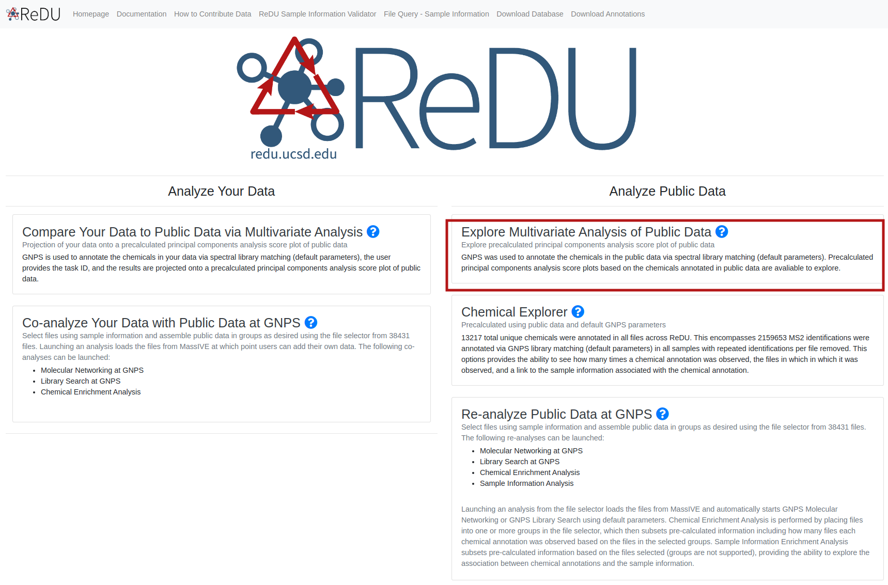
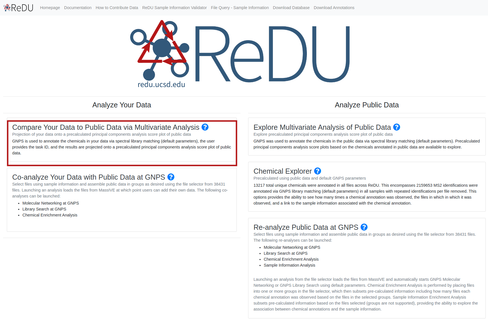

# Multivariate Analysis of Chemical Annotations Provide Context

---

## Re-analysis of Public Data in ReDU

### Summary
The common denominator of all mass spectrometry data is the chemicals detected. In spite of the numerous confounders (*e.g.* instrument type, user, year, and extraction method), the chemicals that are detected and annotated from samples is the ground truth of any experiment. The **MS2 data, specifically product ion scans, are extracted from the public data and analyzed *de novo* in GNPS**, and in doing so provide the chemical annotations based on library spectral matching for each file. **Principal components analysis (PCA)** was used to analyze the results in an unsupervised manner. The results are plotted using Emperor which provides interactive plotting capabilities to explore the data via a PCA score plot. Using Emperor, the user has the ability to change the plot axes, color points by sample information, and filter which data point are plotted based on sample information.

!!! notes
	- data are updated periodically and will not display recently contributed data immediately

!!! info "Example Use Cases"
	- **Explore public data** by comparing the chemicals annotated in samples, analyzed by principal components analysis (PCA), *viz.* human breast milk appears to be most similar to food given their proximity in the PCA score plot.
	- **Begin to explore high-level questions** that remain unanswered when attempting to compare public mass spectrometry data. For example, does urine always look, chemically, like urine year after year, across instruments, across extraction methods, etc?
 
!!! example "Tutorial"
	1. Navigate to the [ReDU-MS2](https://redu.ucsd.edu/) homepage.
	2. Click on the **"Explore Multivariate Analysis of Public Data"** text under the **"Analyze Public Data"** section.
		
	3. Each file is plotted as a point in the PCA score plot. Users can change the PC axes displayed using the drop down.
		
	4. Users can change how the points are colored in the PCA score plot based on a sample information category selected using the drop down menu.
		
	5. Users can filter which samples are plotted in the PCA score plot based on a sample information cateogry using the drop down menu.
		

---

## Re-analysis of Public Data in ReDU: A subset of files selected using the ReDU File Selector

### Summary
The **Launch PCA of Selected Files** function allows the user to perform mulivariate analysis on a subset of files. First, the user selects samples based on sampel information category (*i.e.* MassSpectrometer) through the file filtration interface. A single button click on "Launch PCA of Selected Files" loads all the files and calcualte the principal coordinate analysis values per sample, which then displays via a 3D Emperor visualization.

!!! notes
	- recently contributed data to ReDU will appear after a periodic update. please contact admins for release schedule information.
	- large selections of data will increase the compute time of PCA

!!! info "Example Use Cases"
	- **Explore public data** by comparing a subselection of the public data and visualize the information using PCA.
 
!!! example "Tutorial"
	1. Navigate to the [ReDU](https://redu.ucsd.edu/) homepage.
	2. Click on [Re-analyze Public Data at GNPS](https://redu.ucsd.edu/metadataselection) or [Co-analyze Your Data with Public Data at GNPS](https://redu.ucsd.edu/metadataselection).
	3. Select the files you wish to include in the analysis by clicking the desired group button (*i.e.* G1-G6). The orange buttons in the center of the screen correspond to Sample Information categories.
		- If filter/s are used, they will appear as red box/boxes in the Attribute Filters Panel (upper-right corner) of the page. To remove already selected filters click on the red boxed filter you wish to remove and the item should disappear from Attribute Filters Panel.
		- When files are selected into a group the corresponding button becomes red and the number of files is updated in the Selection Summary Panel (upper-left corner).
	4. Click on the **Launch PCA of Selected Files** button (blue) at the bottom of the page.
		

---

## Co-analysis of Public Data in ReDU

### Summary
The common denominator of all mass spectrometry data is the chemicals detected. In spite of the numerious confounders (*e.g.* instrument type, user, year, and extraction method), the chemicals that are detected and annotated from samples is the ground truth of any experiment. The **MS2 data, specifically product ion scans, are extracted from the public data and analyzed *de novo* in GNPS**, and in doing so provide the chemical annotations based on library spectral matching for each file. **Principal components analysis (PCA)** was used to analyze the results in an unsupervised manner. The results are plotted using Emperor visualization which provides interactive plotting capabilities to explore the data via a PCA score plot. Using the task ID from the GNPS job previously run, your data will be projected on to a precalculated PCA of all ReDU data. 

!!! info "Example Use Cases"
	- **Check your data against public data** by comparing the chemicals annotated in your samples, analyzed by principal components analysis (PCA), versus chemicals annotated in similar chemicals *viz.* does my urine data look like urine data collected by others?
	- **Explore if interesting differences exist** in your data compared to the public data at the highest-level. For example, does urine from my cohort of diabetes subjects looks similar to other data from different diseases?

!!! example "Tutorial"
	1. Log into a [GNPS](https://gnps.ucsd.edu/ProteoSAFe/static/gnps-splash2.jsp) account and perfrom a library search. Once the job has finished running, make note of the task ID found in the URL.
		
	2. Navigate to the [ReDU-MS2](https://redu.ucsd.edu/) homepage and click "Compare Your Data to Public Data via Multivariate Analysis" under the Analyze Your Data Section.
		
	3. Enter the task ID of the previously run GNPS job into the bar, and click the "Create PCA".
		
	4. For cababilities of data exploration tool, please view [Global Multivariate Analysis Documentation](https://mwang87.github.io/ReDU-MS2-Documentation/AnalyzeYourData_MultivariateComparisons/)
	

